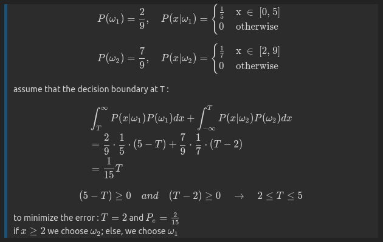
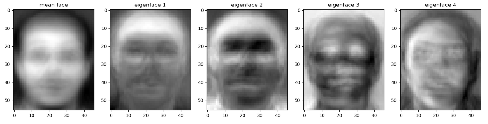
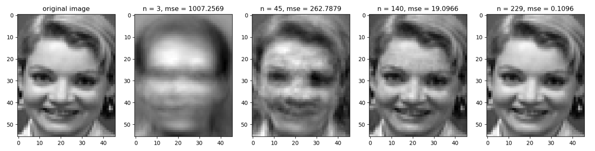
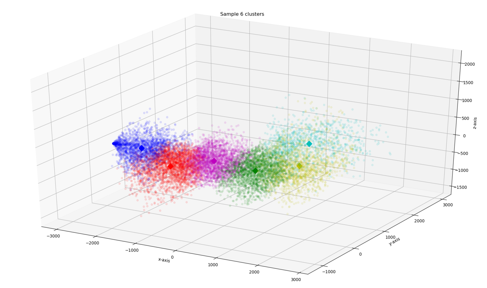
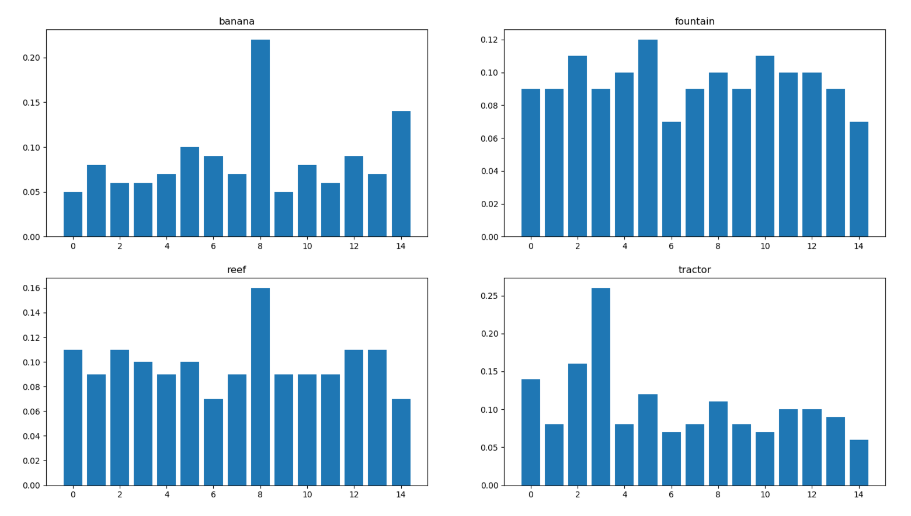

# DLCV HW1

For details of the assignment, please refer to the [pdf](https://github.com/kkeen699/DLCV-spring2019/blob/master/hw1/DLCV_hw1.pdf) provided by TAs.

## Problem 1 Bayes Decision Rule

 

## Problem 2 Principal Component Analysis
1. Mean face and first four eigenfaces

 

2. Reconstruction and MSE

 

3. Apply the k-nearest neighbors (k-NN) algorithm to classify the testing set.

    First, determin the best k and n values by 3-fold cross-validation.
  
    |        | k = 1 | k = 3 | k = 5 
    ---------|-------|-------|------
    n = 3    | 0.704 | 0.617 | 0.521 
    n = 45   | 0.929 | 0.858 | 0.792
    n = 140  | 0.929 | 0.858 | 0.754    

    Choose k = 1, n = 45, and the recognition rate of the testing set is 0.95625.

## Problem 3 Visual Bag-of-Words

1. Use the k-means algorithm to divide the training patches into k clusters. And then randomly select 6 clusters to construct the 3-dimensional PCA subspace.

 

2. Choose one image from each category and visualize its BoW using histogram plot

 

   Adopt the k-NN to perform classification using the above BoW features (k=5), and the c;assification accuracy is 0.558.