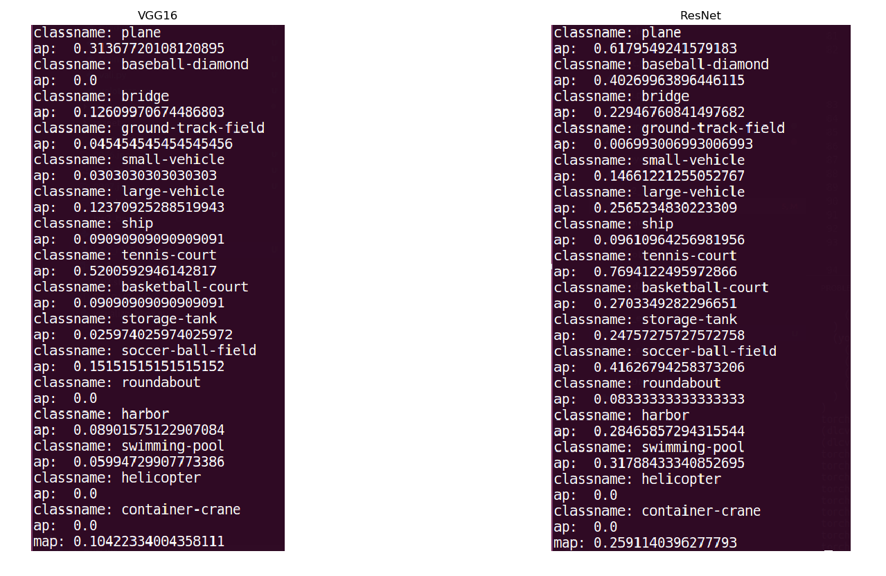
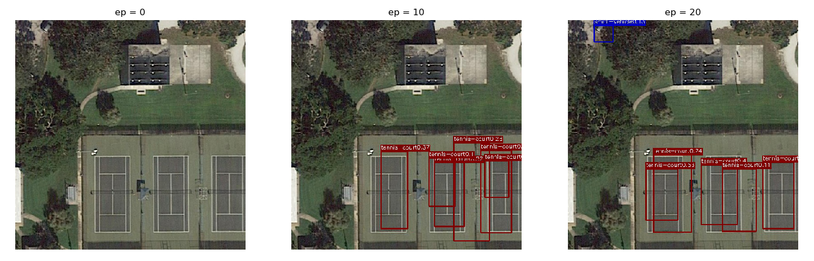
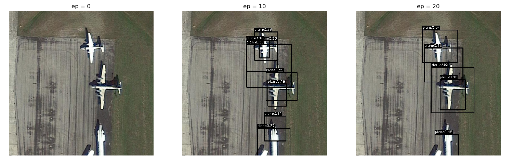
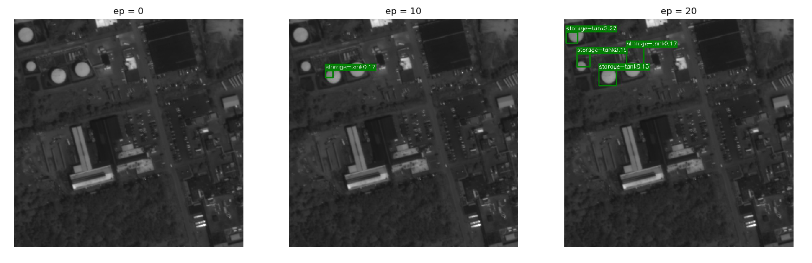
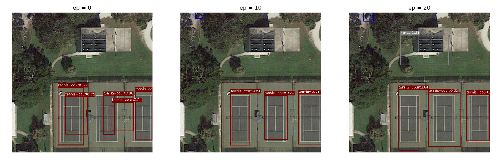
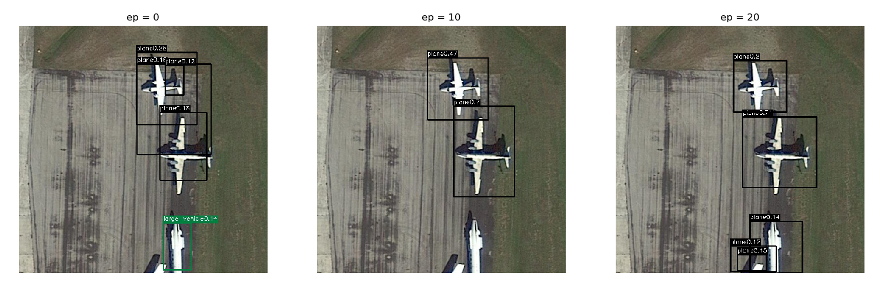
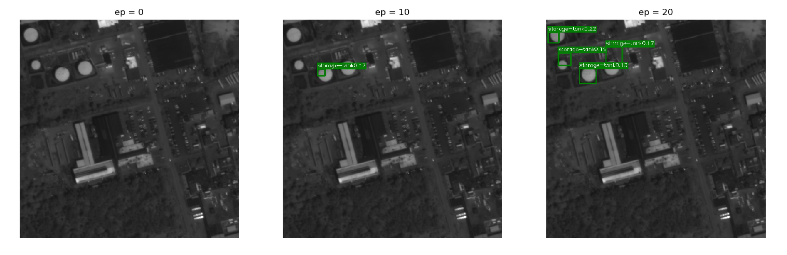

# HW2 ― Object Detection
The task is to implement YOLO to detect and classify the objects present in the images by determining their bounding boxes.

For more details, please refer to the [pdf](https://github.com/kkeen699/DLCV-spring2019/blob/master/hw2/DLCV_hw2.pdf) to view the slides of HW2.

## Usage
### Dataset
A shell script is provided for downloading and extracting the dataset for this assignment. For Linux users, simply use the following command.

    bash ./get_dataset.sh
The shell script will automatically download the dataset and store the data in a folder called `hw2_train_val`. Note that this command by default only works on Linux. If you are using other operating systems, you should download the dataset from [this link](https://docs.google.com/uc?export=download&id=1dWX3wxwH4F9WRRk2GZJLHNRW5mv4HnPk) and unzip the compressed file manually.

### Models
There are two YOLO models. YoloV1 with VGG16_bn backbone and YOLOV1 with ResNet50 backbone

### Training
    python3 train.py <ModelName>
`<ModelName>` shoud be vgg16 or resnet
### Prediction
Run `predict.py` will output predition files.

`hw2.sh` is the shell script file for running the `YoloV1-vgg16bn` model (download trained model and output predition files).

`hw2_best.sh` is the shell script file for running the `YoloV1-resent50` model (download trained model and output predition files).

    bash ./hw2.sh $1 $2
    bash ./hw2_best.sh $1 $2
where `$1` is the testing images directory (e.g. `test/images`), and `$2` is the output prediction directory (e.g. `test/labelTxt_hbb_pred/` ).

### Evaluation
To evaluate your model, you can run the provided evaluation script by using the following command.

    python3 hw2_evaluation_task.py <PredictionDir> <AnnotationDir>

 - `<PredictionDir>` should be the directory to output your prediction files (e.g. `hw2_train_val/val1500/labelTxt_hbb_pred/`)
 - `<AnnotationDir>` should be the directory of ground truth (e.g. `hw2_train_val/val1500/labelTxt_hbb/`)

Note that your predicted label file should have the same filename as that of its corresponding ground truth label file (both of extension ``.txt``).

### Visualization
To visualization the ground truth or predicted bounding boxes in an image, you can run the provided visualization script by using the following command.

    python3 visualize_bbox.py <image.jpg> <label.txt>

## Results

The mAP score of YoloV1-vgg16bn on the validation set is **0.104**.

The mAP score of YoloV1-resnet50 on the validation set is **0.259**.

 

The predicted bbox images at 1st, 10th, 20th epoch.

1. YoloV1-vgg16bn

 

 

 

2. YoloV1-resnet50

 

 

 

