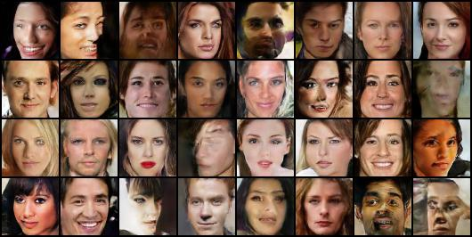
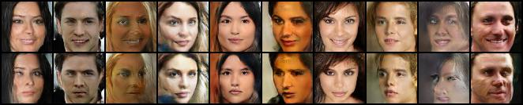
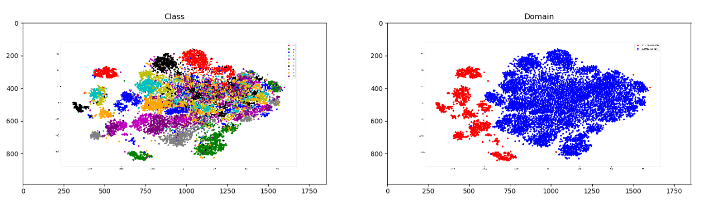
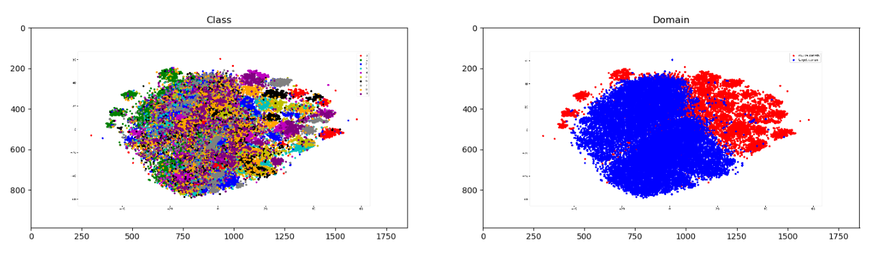
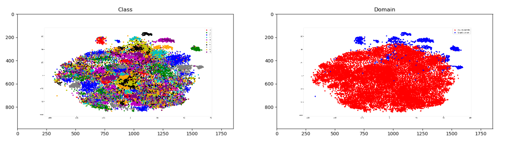
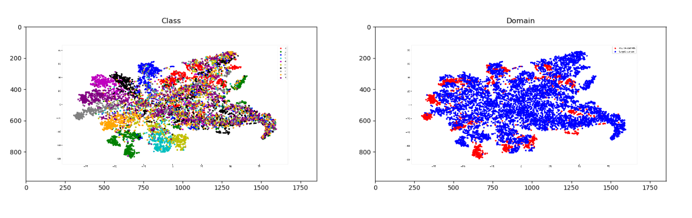
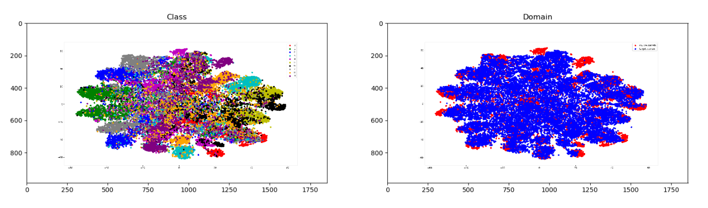
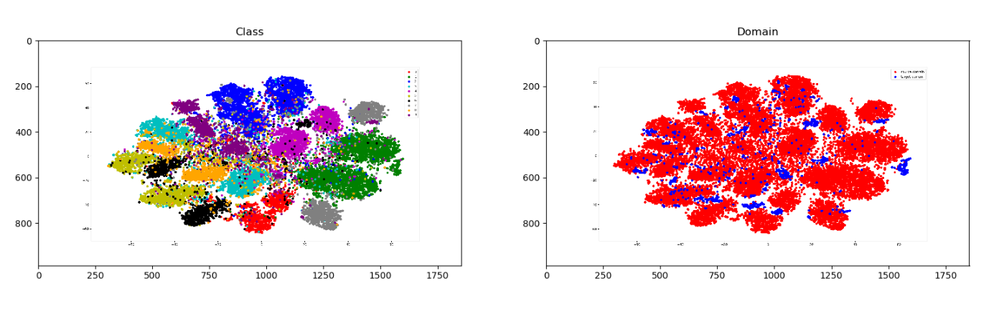

# HW3 ― HW3 ― Image Generation and Feature Disentanglement (GAN, ACGAN), and Unsupervised Domain Adaptation (UDA)
In this assignment, you are given datasets of human face and digit images. You will need to implement the models of both GAN and ACGAN for generating human face images, and the model of DANN for classifying digit images from different domains.

For more details, please refer to the [pdf](https://github.com/kkeen699/DLCV-spring2019/blob/master/hw3/DLCV_hw3.pdf) to view the slides of HW3.

## Usage
### Dataset
A shell script is provided for downloading and extracting the dataset for this assignment. For Linux users, simply use the following command.

    bash ./get_dataset.sh
The shell script will automatically download the dataset and store the data in a folder called `hw3_data`. Note that this command by default only works on Linux. If you are using other operating systems, you should download the dataset from [this link](https://drive.google.com/uc?export=download&id=1gbnGEMyLIsYdIoyUyVZjYK8MzQZs4e_V) and unzip the compressed file manually.

### GAN
To train the model,

    python3 ./GAN/gan_train.py

To plot results using train model, 

    pythons ./GAN/gan_plot.py $1
where `$1` is the output folder.

### ACGAN
To train the model,

    python3 ./ACGAN/acgan_train.py

To plot results using train model, 

    pythons ./ACGAN/acgan_plot.py $1
where `$1` is the output folder.

Besides, `hw3_p1p2.sh` is the shell script file for running GAN and ACGAN models. This script takes as input a folder and should output two images named `fig1_2.jpg` and `fig2_2.jpg` in the given folder.

    bash ./hw3_p1p2.sh $1

### DANN
To train the model,

    pyhon3 ./DANN/dann_train.py $1 $2
where `$1` is the source domain and `$2` is the target domain. They should be usps, mnist-m, or svhn.

To predict results,
`hw3_p3.sh` is the shell script file for running DANN model and outputing a `.csv` file.

    bash ./hw3_p3.sh $1 $2 $3
- `$1` is the directory of testing images in the **target** domain.
- `$2` is a string that indicates the name of the target domain, which will be either `mnistm`, `usps` or `svhn`.
- `$3` is the path to your output prediction file (e.g. `hw3_data/digits/mnistm/test_pred.csv`).

### ADDA
To train the source encoder and the classifier of ADDA, 

    pythons ./ADDA/adda_pretrain.py $1
where `$1` is the source domain.

To train the target encoder and the discriminator of ADDA,

    pythons ./ADDA/adda_train.py $1
where `$1` is the source domain.

To predict results,
`hw3_p4.sh` is the shell script file for running DANN model and outputing a `.csv` file.

    bash ./hw4_p3.sh $1 $2 $3
- `$1` is the directory of testing images in the **target** domain.
- `$2` is a string that indicates the name of the target domain, which will be either `mnistm`, `usps` or `svhn`.
- `$3` is the path to your output prediction file (e.g. `hw3_data/digits/mnistm/test_pred.csv`).

### Evaluation
To evaluate the UDA models, you can run the evaluation script by using the following command.

    python3 hw3_eval.py $1 $2

 - `$1` is the path to your predicted results (e.g. `hw3_data/digits/mnistm/test_pred.csv`)
 - `$2` is the path to the ground truth (e.g. `hw3_data/digits/mnistm/test.csv`)

Note that for `hw3_eval.py` to work, your predicted `.csv` files should have the same format as the ground truth files we provided in the dataset as shown below.

| image_name | label |
|:----------:|:-----:|
| 00000.png  | 4     |
| 00001.png  | 3     |
| 00002.png  | 5     |
| ...        | ...   |

## Results

### GAN
Plot 32 random images generated from GAN.

 

### ACGAN
Plot 10 random pairs of generated images from ACGAN, where each pair should be generated from the same random vector input but with opposite attribute.

 

### DANN
1. Compute the accuracy on target domain, while the model is trained on source domain only/ source and target domain/ target domain only.
   |                 | USPS -> MNIST-M | MNIST-M -> SVHN | SVHN -> USPS
    -----------------|-----------------|-----------------|------
    Trained on source| 23.36%          | 24.29%          | 67.61% 
    Adaptation(DANN) | 44.42%          | 51.36%          | 57.70%
    Trained on target| 98.45%          | 92.77%          | 97.26% 

2. Visualize the latent space by mapping the testing images to 2D space (with t-SNE) and use different colors to indicate data of (a) different digit classes 0-9 and (b) different domains.
    - USPS -> MNIST-M
    
 
    
    

    - MNIST-M -> SVHN
    
 
    
    

    - SVHN -> USPS
    
 
    
    

### ADDA
1. Compute the accuracy on target domain, while the model is trained on source and target domain. 
   |                 | USPS -> MNIST-M | MNIST-M -> SVHN | SVHN -> USPS
    -----------------|-----------------|-----------------|------
    Adaptation(ADDA) | 34.42%          | 45.37%          | 38.96%
2. Visualize the the latent space by mapping the testing images to 2D space (with t-SNE) and use different colors to indicate data of (a) different digits classes 0-9 and (b) different domains (source/target).

    - USPS -> MNIST-M
    
 
    
    

    - MNIST-M -> SVHN
    
 
    
    

    - SVHN -> USPS
    
 
    
    
