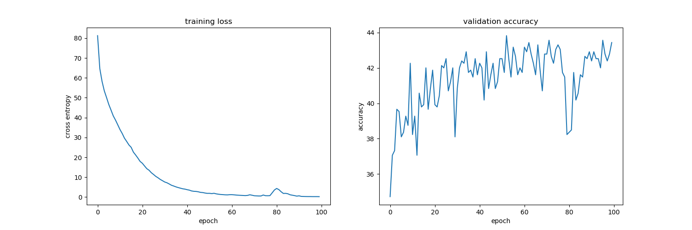
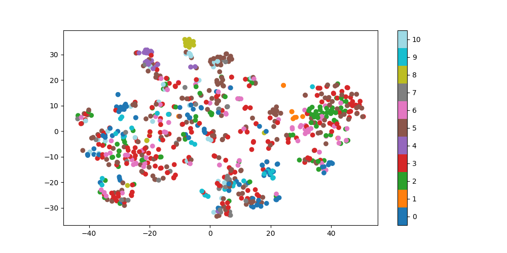
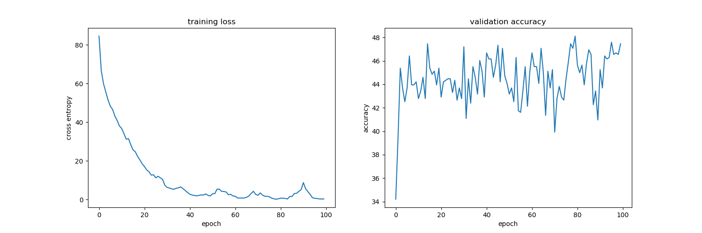
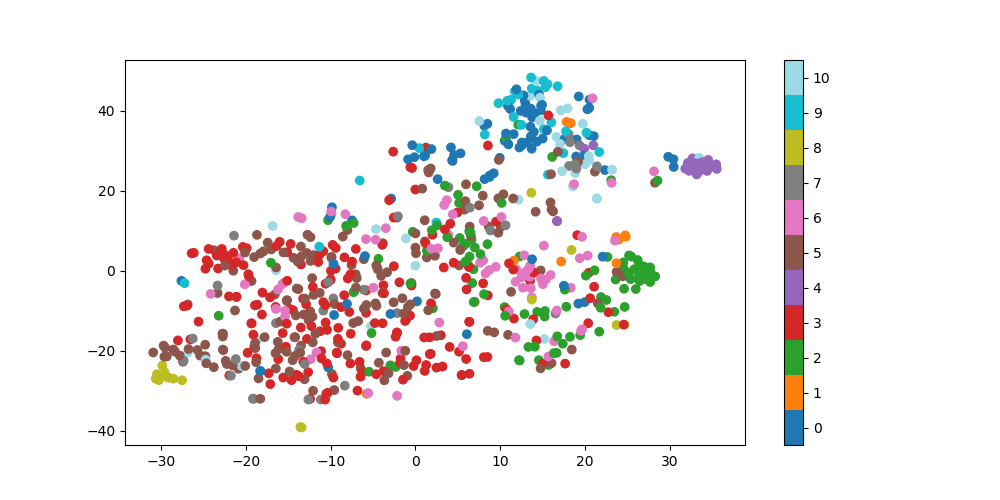
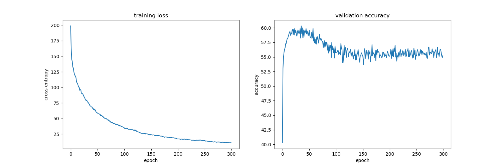
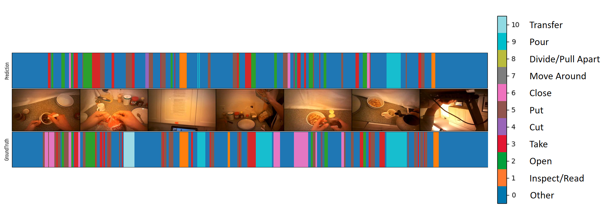

# HW4 ― Recurrent Neural Networks (RNN) for Action Recognition
In this assignment, you will learn to perform both trimmed action recognition and temporal action segmentation in full-length videos.

For more details, please refer to the [pdf](https://github.com/kkeen699/DLCV-spring2019/blob/master/hw4/DLCV_hw4.pdf) to view the slides of HW4.

## Usage

### Dataset
A shell script is provided for downloading and extracting the dataset for this assignment. For Linux users, simply use the following command.

    bash ./get_dataset.sh
The shell script will automatically download the dataset and store the data in a folder called `hw4_data`. Note that this command by default only works on Linux. If you are using other operating systems, you should download the dataset from [this link](https://drive.google.com/uc?export=download&id=1ncmqWLctmvecIXBdVng5cvbROoTWFSpE) and unzip the compressed file manually.

For this dataset, the action labels are defined as below:

|       Action      | Label |
|:-----------------:|:-----:|
| Other             | 0     |
| Inspect/Read      | 1     |
| Open              | 2     |
| Take              | 3     |
| Cut               | 4     |
| Put               | 5     |
| Close             | 6     |
| Move Around       | 7     |
| Divide/Pull Apart | 8     |
| Pour              | 9     |
| Transfer          | 10    |

### Utility
A Python script is provided for reading video files and retrieving labeled videos as a dictionary. For more information, please read the comments in [`reader.py`](reader.py).

### Problem 1 Data Preprocessing
Extract CNN-based video feature by ResNet50 and average pooling.

To extract CNN features by ResNet50

    python3 ./p1/p1_video2cnn.py
It will save feaures by pickle.

To train the model, 

    python3 ./p1/p1_train.py
To predict result, 

    bash ./hw4_p1.sh $1 $2 $3
-   `$1` is the folder containing the ***trimmed*** validation videos (e.g. `TrimmedVideos/video/valid/`).
-   `$2` is the path to the ground truth label file for the videos (e.g. `TrimmedVideos/label/gt_valid.csv`).
-   `$3` is the folder to which you should output your predicted labels (e.g. `./output/`).

### Problem 2 Trimmed Action Recognition
Two-layer LSTM

To extract CNN features by ResNet50

    python3 ./p2/p2_video2cnn.py
It will save feaures by pickle.

To train the model, 

    python3 ./p2/p2_train.py
To predict result, 

    bash ./hw4_p2.sh $1 $2 $3
-   `$1` is the folder containing the ***trimmed*** validation/test videos.
-   `$2` is the path to the ground truth label file for the videos (e.g. `TrimmedVideos/label/gt_valid.csv` or `TrimmedVideos/label/gt_test.csv`).
-   `$3` is the folder to which you should output your predicted labels (e.g. `./output/`).

### Problem 3 Seq-to-Seq prediction in full-length videos
Two-layer LSTM

To extract CNN features by ResNet50

    python3 ./p3/p3_feature.py
It will save feaures by pickle.

To train the model, 

    python3 ./p3/p3_train.py
To predict result, 

    bash ./hw4_p3.sh $1 $2
-   `$1` is the folder containing the ***full-length*** validation videos.
-   `$2` is the folder to which you should output your predicted labels (e.g. `./output/`).

## Results

### Problem 1 Data Preprocessing

At epoch 100, the validation accuracy is **43.43%**.

The loss curve of training set and the curve of validation accuracy

 

Visualize CNN-based video features to 2D space (with tSNE)

 

### Problem 2 Trimmed Action Recognition

At epoch 100, the validation accuracy is **47.46%**.

The loss curve of training set and the curve of validation accuracy

 

Visualize RNN-based video features to 2D space (with tSNE)

 

### Problem 3 Seq-to-Seq prediction in full-length videos

At epoch 100, the validation accuracy is **55.75%**.

The loss curve of training set and the curve of validation accuracy

 

Visualization of temporal action segmentation (OP03-R04-ContinentalBreakfast)

 

